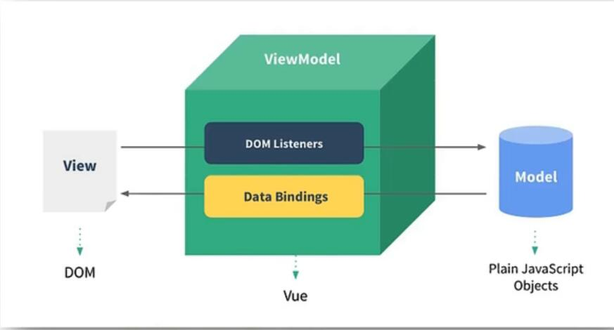

## Vue学习笔记
* 参考课程：《尚硅谷Vue2.0+Vue3.0全套教程丨vuejs从入门到精通》
* 参考链接：https://www.bilibili.com/video/BV1Zy4y1K7SH?vd_source=4f4d3466cdc2c5a2539504632c862ce7
* 笔记上传说明：上述课程中共有168节小课，对每10次课的笔记整合之后上传一次。

### //20220807开始学习笔记

Vue是渐进式前端框架。

Vue的特点：
1.	采用组件模式提高代码复用率，一个.vue文件就是一个组件，其中包含了：html/css/js；
2.	声明式编码，直接在模板中添加数据即可，而不需要在常规的html/css/js中命令式编码，按照步骤严格执行；
 
3.	使用虚拟DOM+优秀的Diff算法，尽量复用DOM节点；

使用原生js实现对应页面真实DOM。

 

Diff算法：将新的需要的虚拟DOM和原来的虚拟DOM进行比较，如果原来虚拟的DOM中有新的虚拟DOM中重复出现的，那么直接在新的虚拟DOM中复用原来的DOM内容即可。

官网：cn.vuejs.org中包含的内容：

开发过程中遇到不会的，查询api即可。

官方教程很重要，里面有很多知识点，但是都遵循的API。

风格指南：VUE教你学习更加优雅的代码。

示例：提供一些vue使用的例子，作为参考。

Cookbook：技巧，js/vue框架中的技巧。

帮助/聊天室/工具/核心插件/信息：其中工具：vue-cli（vue脚手架）是比较重要的，后期学习的vue-router（vue路由）。

团队：展示了vue框架的作者。

主题：官方提供的一些样式和结构。

Awesome VUE官方整理的一些比较好用的包：报表/表格/等。

浏览和VUE相关的包：可以看到很多VUE中有用的包。

#### 004-VUE环境搭建：

VUE官方文档中推荐学习VUE的第一种方式就是创建并运行HelloWorld项目。同时，文档中还列出了安装教程，其中包含不同的安装方式和教程。

安装方式：1.直接用script引入方式进行安装；2.使用NPM方式安装（配合命令行工具使用）；

CDN的使用：开发版本和生产版本的使用选择。

Vue.config属性是全局属性设置，修改一次可以实现全局属性的修改。

其中，Vue.config.productionTip = false，表示取消开发过程中出现的调试Tip过程。

浏览器打开页面时，默认请求页面图标信息。

Vscode中的live server插件，比较好用。启动上述的服务器之后，项目中的所有文件都将作为启动的5500服务器的根资源进行运行。

### //2022.8.9下午14:52开始学习笔记

Script标签中使用{{}}来动态解析字符串。Vue后端会对页面中出现的可能存在的vue语法进行扫描，扫描到之后对符号进行处理。使用script标签中的逻辑替换掉html中写的原始标签。

### //2022.8.10下午15:12开始学习笔记

#### 007 hello world案例分析

Vue使用id寻找html中标签时，只对第一个命中id的进行数据的填充，对后边的不再进行解析。

单个容器对应多个vue实例的话，第一个vue实例可以填充数据，但是第二个vue中的data数据无法填充。因为一个容器只能被一个vue实例接管，第二个vue实例虽然定位到了容器，但是由于此时第一个vue实例已经接管了容器，所以第二个vue实例对容器没有任何作用。

容器和vue实例是一一对应的。

### //2022.8.11日下午12:55开始学习笔记
在浏览器中打开vue调试工具之后，可以看到一个Root，这代表一个vue实例。

vue实例中data数据发生改变，那么页面中的显示数据也会更新。

{{xxx}}中的xxx需要写js表达式，然后xxx会从vue实例中找到data中的所有属性。

#### 007模板语法

name.toUpperCase()叫做插值语法。

v-表示vue中的属性。

<a v-bind:href="url">点我去百度</a>
上述代码中url被当作了js表达式进行执行，url表达式变量。

使用v-bind表示将url表达式解析的结果绑定到href中。

v-bind不仅可以指定典型的属性，还可以指定自定义属性x等。
例如：v-bind:x='hello'

v-bind可以简写为:

只有v-bind可以简写为 ":"

插值语法往往制定标签体内容。

指令语法往往用于绑定标签中的属性，解析标签内容，指令模板功能很强大。

在开发时建议将data数据设计为多级的结构。

类似于：
data:{
    title:"title_test",
    shcool:{
        url:"",
        name:"",
        age:""
    }

}

#### 008数据绑定
v-bind是一个单向的数据绑定。

v-model不是所有的标签都可以使用的，v-model属性只能应用在表单类元素上。因为v-model需要捕获标签的value属性值，但是非表单标签没有value属性，也就是v-model无法读取非表单类标签的值，那么就无法进行双向的v-model数据绑定。

重点：v-model:value可以简写为v-model，因为v-model默认绑定的value的值。

//截止到2022.8.11 下午18：29为止

### //2022.8.12上午7：57开始学习笔记

#### el与data的两种写法

vue对象中使用了$符号的均是给程序员使用的。

以后写组件的时候，对数据的使用一定是data函数式。

data:function(){
                console.log(this) //此处的this为vue实例对象
                return{
                    name:'test'
                }
                }
            
上述这种情况中data里面的this对象是vue实例

下面这种情况中data中的this对象是window实例
data:()=>{
                console.log(this) //此处的this为vue实例对象
                return{
                    name:'test'
                }
}

因为使用箭头函数没有自己的this对象，就向外找，找到了全局的window实例。

使用function函数来写的时候可以简写为：
data(){

}

#### 010-架构模型，MVVM模型

vue的设计收到了MVVM的启发。

MVVM软件架构中：
model对应的vue中data数据；
view对应的就是模板；
view-model对应的vue实例对象；其中包含：data bindings和dom listeners
下面为mvvm的架构图：

MVVM模型实际上就是将data数据和dom进行了连接，其中的view-model做了连接的作用。

经常在开发中会使用vm变量名表示vue的实例对象。

data中的各组key-value最终出现在view（vm）身上。

data中的数据最终会在vm中体现出来，然后vm就会和view组件进行绑定，显示出来。除了自定义的数据属性之外，
vm中还有很多属性都可以在页面显示出来（例如：$开头的各个属性，和_c等属性）。也就是说，vm中的所有属性，
Vue原型上的所有属性，都会显示在Vue模板中。

